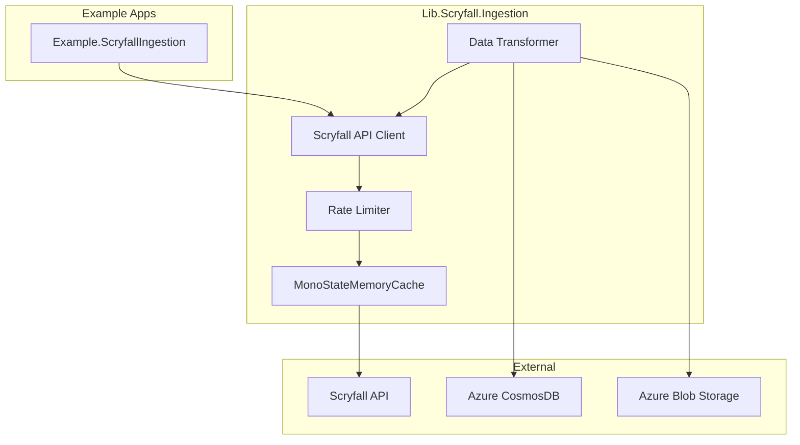
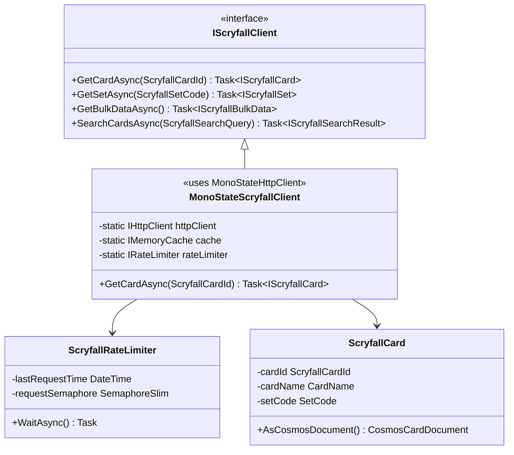
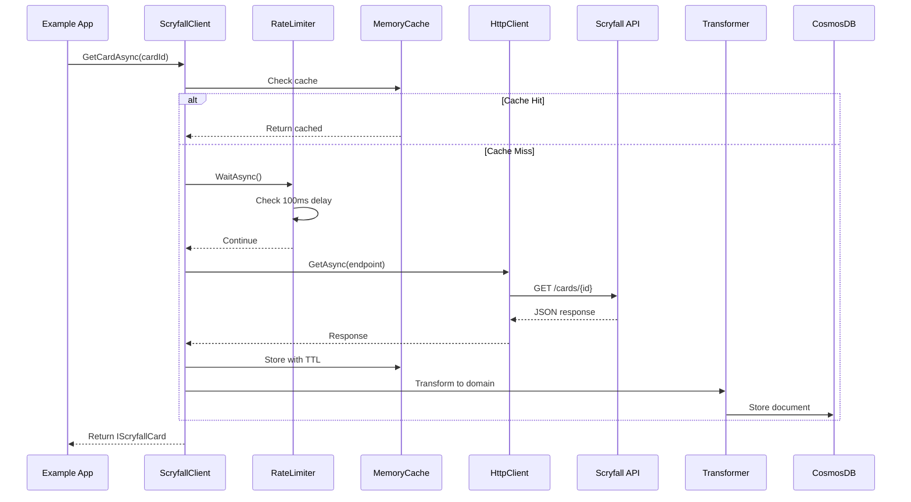

# Design: Scryfall Ingestion

## Overview

This design document describes the technical implementation of the Scryfall Ingestion feature, which provides comprehensive data ingestion from the Scryfall API into Azure CosmosDB. The design follows MicroObjects principles, leveraging existing patterns from Lib.Cosmos and Lib.BlobStorage while introducing new components specific to external API integration.

## Steering Document Alignment

### Tech.md Alignment
- **MicroObjects Pattern**: Every Scryfall concept wrapped in domain objects (ScryfallCardId, SetCode, etc.)
- **No Primitives**: All values use ToSystemType<T> pattern from Lib.Universal
- **MonoState Pattern**: HTTP client and cache follow established MonoState patterns
- **Configuration**: Uses IConfig and MonoStateConfig from Lib.Universal
- **Testing**: Fakes only, no mocks, following TypeWrapper pattern for private constructors

### Structure.md Alignment
- **Library Naming**: Lib.Scryfall.Ingestion follows Lib.* convention
- **Folder Structure**: Apis/ for public, internal operations elsewhere
- **Operator Pattern**: Gopher/Inquisitor/Harvester follow established patterns
- **Configuration Classes**: ConfigScryfall* prefix following convention
- **Example App**: Example.ScryfallIngestion demonstrates functionality

## Code Reuse Analysis

### Leveraging Existing Components

#### From Lib.Universal
- **MonoStateHttpClient**: HTTP client management (no new HttpClient)
- **MonoStateMemoryCache**: Direct usage for caching (no new implementation)
- **ToSystemType<T>**: Base for all domain objects
- **MonoStateConfig**: Configuration management
- **ServiceLocator**: Service registration and resolution
- **Polly Integration**: Rate limiting and retry policies

#### From Lib.Cosmos
- **CosmosScribe**: Base pattern for write operations
- **CosmosGopher**: Base pattern for read operations
- **OpResponse<T>**: Response wrapper pattern
- **CosmosContainerAdapter**: Pattern for container operations

#### From Lib.BlobStorage
- **BlobWriteScribe**: For image storage operations
- **BlobPathEntity**: Path management pattern
- **MonoStateBlobClientAdapter**: MonoState pattern reference

## Architecture

### High-Level Architecture



### Component Architecture



## Detailed Design

### Library Structure: Lib.Scryfall.Ingestion

```
Lib.Scryfall.Ingestion/
├── Adapters/
│   ├── IScryfallHttpAdapter.cs
│   ├── ScryfallHttpAdapter.cs
│   └── MonoStateScryfallAdapter.cs
├── Apis/
│   ├── IScryfallClient.cs
│   ├── ScryfallClient.cs
│   ├── Configurations/
│   │   ├── IScryfallConfiguration.cs
│   │   ├── IScryfallApiConfig.cs
│   │   ├── IScryfallCacheConfig.cs
│   │   └── IScryfallRateLimitConfig.cs
│   ├── Ids/
│   │   ├── ScryfallCardId.cs
│   │   ├── ScryfallSetCode.cs
│   │   ├── CollectorNumber.cs
│   │   └── MultiverseId.cs
│   ├── Models/
│   │   ├── IScryfallCard.cs
│   │   ├── IScryfallSet.cs
│   │   ├── IScryfallBulkData.cs
│   │   └── IScryfallSearchResult.cs
│   └── Operators/
│       ├── ScryfallGopher.cs        # Read operations
│       ├── ScryfallInquisitor.cs    # Search operations
│       └── ScryfallHarvester.cs     # Bulk operations
├── Configurations/
│   ├── ConfigScryfallConfiguration.cs
│   ├── ConfigScryfallApiConfig.cs
│   ├── ConfigScryfallCacheConfig.cs
│   ├── ConfigScryfallRateLimitConfig.cs
│   └── ConfigScryfallRetryConfig.cs
├── Models/
│   ├── ScryfallCard.cs
│   ├── ScryfallSet.cs
│   ├── ScryfallBulkData.cs
│   ├── ScryfallSearchResult.cs
│   └── Responses/
│       ├── ScryfallApiResponse.cs
│       └── ScryfallErrorResponse.cs
├── Operations/
│   ├── RateLimiting/
│   │   ├── IRateLimiter.cs
│   │   ├── ScryfallRateLimiter.cs
│   │   └── ExponentialBackoff.cs
│   ├── Caching/
│   │   ├── ICacheKeyGenerator.cs
│   │   ├── ScryfallCacheKeyGenerator.cs
│   │   └── CacheEntry.cs
│   └── Transformation/
│       ├── IDataTransformer.cs
│       ├── ScryfallToCosmosTransformer.cs
│       └── ImageUrlExtractor.cs
└── Lib.Scryfall.Ingestion.csproj
```

### Core Components

#### 1. Polly-Based Rate Limiting and Retry Policies

```csharp
internal sealed class ScryfallPolicyProvider : IScryfallPolicyProvider
{
    private readonly IAsyncPolicy<HttpResponseMessage> _httpPolicy;
    private readonly IAsyncPolicy _cosmosPolicy;
    private readonly SemaphoreSlim _rateLimitSemaphore;
    
    public ScryfallPolicyProvider(IScryfallConfiguration config)
    {
        _rateLimitSemaphore = new SemaphoreSlim(1, 1);
        
        // Scryfall API policy: Rate limiting + Retry with exponential backoff
        _httpPolicy = Policy.WrapAsync(
            CreateRateLimitPolicy(config.RateLimit()),
            CreateRetryPolicy(config.Retry())
        );
        
        // Cosmos DB policy: Retry on throttling (429)
        _cosmosPolicy = Policy
            .Handle<CosmosException>(ex => ex.StatusCode == HttpStatusCode.TooManyRequests)
            .WaitAndRetryAsync(
                retryCount: 5,
                sleepDurationProvider: (retryAttempt, exception, context) =>
                {
                    if (exception is CosmosException cosmosEx && cosmosEx.RetryAfter.HasValue)
                    {
                        return cosmosEx.RetryAfter.Value;
                    }
                    return TimeSpan.FromSeconds(Math.Pow(2, retryAttempt));
                },
                onRetryAsync: async (outcome, timespan, retryCount, context) =>
                {
                    _logger.LogWarning($"Cosmos throttled, retry {retryCount} after {timespan}");
                }
            );
    }
    
    private IAsyncPolicy<HttpResponseMessage> CreateRateLimitPolicy(IRateLimitConfig config)
    {
        return Policy.RateLimitAsync<HttpResponseMessage>(
            config.RequestsPerSecond().AsSystemType(),
            TimeSpan.FromSeconds(1),
            config.MaxBurst().AsSystemType()
        );
    }
    
    private IAsyncPolicy<HttpResponseMessage> CreateRetryPolicy(IRetryConfig config)
    {
        return Policy
            .HandleResult<HttpResponseMessage>(r => r.StatusCode == HttpStatusCode.TooManyRequests)
            .OrResult(r => r.StatusCode >= HttpStatusCode.InternalServerError)
            .WaitAndRetryAsync(
                config.MaxAttempts().AsSystemType(),
                retryAttempt => TimeSpan.FromSeconds(Math.Pow(
                    config.BackoffMultiplier().AsSystemType(), 
                    retryAttempt - 1
                )),
                onRetryAsync: async (outcome, timespan, retryCount, context) =>
                {
                    _logger.LogWarning($"Retry {retryCount} after {timespan}");
                }
            );
    }
    
    public IAsyncPolicy<HttpResponseMessage> HttpPolicy() => _httpPolicy;
    public IAsyncPolicy CosmosPolicy() => _cosmosPolicy;
}
```

#### 2. HTTP Adapter with Polly and Caching

```csharp
internal sealed class MonoStateScryfallAdapter : IScryfallHttpAdapter
{
    private static readonly IHttpClient s_httpClient = new MonoStateHttpClient();
    private static readonly IMemoryCache s_cache = new MonoStateMemoryCache();
    private static readonly IScryfallPolicyProvider s_policyProvider = new ScryfallPolicyProvider();
    
    public async Task<ScryfallApiResponse> GetAsync(ScryfallEndpoint endpoint)
    {
        CacheKey key = new ScryfallCacheKeyGenerator().Generate(endpoint);
        
        if (s_cache.TryGetValue(key.AsSystemType(), out ScryfallApiResponse cached))
        {
            return cached;
        }
        
        // Execute with Polly policies (rate limiting + retry)
        HttpResponseMessage response = await s_policyProvider.HttpPolicy()
            .ExecuteAsync(async () =>
            {
                HttpRequestMessage request = new(HttpMethod.Get, endpoint.AsSystemType());
                request.Headers.Add("User-Agent", UserAgent.AsSystemType());
                return await s_httpClient.SendAsync(request).ConfigureAwait(false);
            }).ConfigureAwait(false);
            
        if (response.IsSuccessStatusCode)
        {
            ScryfallApiResponse result = await ParseResponse(response).ConfigureAwait(false);
            s_cache.Set(key.AsSystemType(), result, CacheDuration.ForEndpoint(endpoint));
            return result;
        }
        
        return await HandleError(response).ConfigureAwait(false);
    }
}
```

#### 3. Domain Models (Following MicroObjects)

```csharp
public sealed class ScryfallCard : IScryfallCard
{
    private readonly ScryfallCardId _id;
    private readonly ScryfallSetId _setId;
    private readonly JObject _rawData;
    
    public ScryfallCardId Id() => _id;
    public ScryfallSetId SetId() => _setId;
    public JObject RawData() => _rawData;
    
    public SourceDataDocument AsCardItemDocument()
    {
        // For CardItems container
        return new SourceDataDocument(
            new CosmosItemId(_id.AsSystemType()),
            new PartitionKeyValue(_id.AsSystemType()),
            _rawData
        );
    }
    
    public SourceDataDocument AsSetCardDocument()
    {
        // For SetCards container
        return new SourceDataDocument(
            new CosmosItemId(_id.AsSystemType()),
            new PartitionKeyValue(_setId.AsSystemType()),
            _rawData
        );
    }
}

public sealed class SourceDataDocument : CosmosItem
{
    private readonly JObject _data;
    
    public SourceDataDocument(CosmosItemId id, PartitionKeyValue partition, JObject data)
        : base(id, partition)
    {
        _data = data;
    }
    
    [JsonProperty("data")]
    public JObject Data => _data;
}
```

#### 4. Monitoring Dashboard (US-007)

```csharp
public sealed class ScryfallIngestionMonitor : IScryfallIngestionMonitor
{
    private readonly IMemoryCache _metricsCache;
    private readonly IngestionProgress _progress;
    
    public IngestionMetrics GetMetrics()
    {
        return new IngestionMetrics(
            _progress.CurrentProgress(),
            _progress.EstimatedCompletion(),
            GetCacheHitRatio(),
            GetApiResponseTimes(),
            GetErrorRate()
        );
    }
    
    public void RecordApiCall(ApiCallResult result)
    {
        // Track success/failure, response time, cache hit/miss
        if (5.0 < GetErrorRateForWindow(TimeSpan.FromMinutes(5)))
        {
            TriggerAlert(new ErrorThresholdExceeded());
        }
    }
}
```

#### 5. Scheduling and Orchestration (FR-006)

```csharp
public sealed class ScryfallScheduledIngestion : IScheduledIngestion
{
    private readonly IScryfallClient _client;
    private readonly IIngestionStateRepository _stateRepo;
    private readonly SemaphoreSlim _executionLock = new(1, 1);
    
    public async Task ExecuteDailyUpdateAsync()
    {
        if (await _executionLock.WaitAsync(0).ConfigureAwait(false) is false)
        {
            _logger.LogWarning("Ingestion already in progress");
            return;
        }
        
        try
        {
            LastSyncTimestamp lastSync = await _stateRepo.GetLastSyncAsync()
                .ConfigureAwait(false);
            
            await PerformIncrementalUpdate(lastSync).ConfigureAwait(false);
            
            await _stateRepo.SaveSyncStateAsync(DateTime.UtcNow)
                .ConfigureAwait(false);
        }
        finally
        {
            _executionLock.Release();
        }
    }
}
```

#### 6. Image Storage Handler

```csharp
public sealed class ScryfallImageStorageHandler : IScryfallImageStorageHandler
{
    private readonly IBlobWriteScribe _blobScribe;
    
    public async Task StoreCardImagesAsync(IScryfallCard card)
    {
        ScryfallCardId cardId = card.Id();
        ScryfallSetCode setCode = card.SetCode();
        
        // Front face images
        if (card.HasFrontImages())
        {
            await StoreImageSetAsync(
                card.FrontImageUris(),
                $"card-images/{setCode.AsSystemType()}/{cardId.AsSystemType()}/front/"
            ).ConfigureAwait(false);
        }
        
        // Back face images (for double-faced cards)
        if (card.HasBackImages())
        {
            await StoreImageSetAsync(
                card.BackImageUris(),
                $"card-images/{setCode.AsSystemType()}/{cardId.AsSystemType()}/back/"
            ).ConfigureAwait(false);
        }
        
        // Associated cards (for meld cards)
        foreach (IRelatedCard related in card.RelatedCards())
        {
            if (related.IsMeldPart() || related.IsAssociated())
            {
                await StoreImageSetAsync(
                    related.ImageUris(),
                    $"card-images/{setCode.AsSystemType()}/{cardId.AsSystemType()}/associated/{related.Id().AsSystemType()}/"
                ).ConfigureAwait(false);
            }
        }
    }
    
    private async Task StoreImageSetAsync(IImageUris uris, string basePath)
    {
        foreach (ImageResolution resolution in uris.AvailableResolutions())
        {
            BlobPathEntity path = new($"{basePath}{resolution.AsSystemType()}.jpg");
            await _blobScribe.WriteAsync(path, uris.GetImage(resolution))
                .ConfigureAwait(false);
        }
    }
}
```

#### 7. Operators with Polly Integration

```csharp
public sealed class ScryfallGopher : IScryfallGopher
{
    private readonly IScryfallHttpAdapter _adapter;
    private readonly ILogger _logger;
    
    public async Task<IScryfallCard> GetCardAsync(ScryfallCardId cardId)
    {
        ScryfallEndpoint endpoint = ScryfallEndpoint.Card(cardId);
        ScryfallApiResponse response = await _adapter.GetAsync(endpoint)
            .ConfigureAwait(false);
            
        return new ScryfallCard(response.AsCard());
    }
}

public sealed class ScryfallCosmosScribe : IScryfallCosmosScribe
{
    private readonly ICosmosContainerAdapter _container;
    private readonly IScryfallPolicyProvider _policyProvider;
    
    public async Task<OpResponse<SourceDataDocument>> WriteCardAsync(IScryfallCard card)
    {
        // Execute Cosmos write with Polly throttling policy
        return await _policyProvider.CosmosPolicy()
            .ExecuteAsync(async () =>
            {
                SourceDataDocument document = card.AsCardItemDocument();
                return await _container.UpsertItemAsync(
                    document,
                    new PartitionKey(document.Partition)
                ).ConfigureAwait(false);
            }).ConfigureAwait(false);
    }
    
    public async Task WriteBatchAsync(IEnumerable<IScryfallCard> cards)
    {
        // Batch operations with throttling protection
        foreach (IScryfallCard card in cards)
        {
            await _policyProvider.CosmosPolicy()
                .ExecuteAsync(async () =>
                {
                    // Write to both CardItems and SetCards containers
                    await WriteToContainer("CardItems", card.AsCardItemDocument())
                        .ConfigureAwait(false);
                    await WriteToContainer("SetCards", card.AsSetCardDocument())
                        .ConfigureAwait(false);
                }).ConfigureAwait(false);
        }
    }
}
```

### Data Flow

#### Card Ingestion Flow



### Storage Design

#### CosmosDB Structure

##### Database: MtgDiscoverySourceData
All imported data from external sources (Scryfall, TCGPlayer, etc.)

```json
{
  "database": "MtgDiscoverySourceData",
  "containers": [
    {
      "name": "SetItems",
      "partitionKey": "/partition",
      "document": {
        "id": "{setCode}",
        "partition": "{setId}",
        "data": {
          // Full Scryfall set JSON payload
        }
      }
    },
    {
      "name": "SetAssociations",
      "partitionKey": "/partition",
      "document": {
        "id": "{setId}",
        "partition": "{parentSetId}",
        "data": {
          // Scryfall set relationship data
        }
      }
    },
    {
      "name": "SetCards",
      "partitionKey": "/partition",
      "document": {
        "id": "{cardId}",
        "partition": "{setId}",
        "data": {
          // Full Scryfall card JSON payload
        }
      }
    },
    {
      "name": "CardItems",
      "partitionKey": "/partition",
      "document": {
        "id": "{cardId}",
        "partition": "{cardId}",
        "data": {
          // Full Scryfall card JSON payload (master copy)
        }
      }
    },
    {
      "name": "ArtistItems",
      "partitionKey": "/partition",
      "document": {
        "id": "{artistId}",
        "partition": "{artistId}",
        "name": "Artist Name",
        "uri": "https://..."
      }
    },
    {
      "name": "SetArtists",
      "partitionKey": "/partition",
      "document": {
        "id": "{artistId}",
        "partition": "{setId}",
        "cardCount": 10
      }
    },
    {
      "name": "IngestionState",
      "partitionKey": "/partition",
      "document": {
        "id": "lastSync",
        "partition": "state",
        "timestamp": "2024-01-01T00:00:00Z",
        "cardsProcessed": 50000,
        "status": "completed"
      }
    }
  ]
}
```

##### Database: MtgDiscoveryUserData
All user-created data (collections, decks, wishlists, etc.)

```json
{
  "database": "MtgDiscoveryUserData",
  "containers": [
    {
      "name": "Collections",
      "partitionKey": "/partition",
      "document": {
        "id": "{collectionItemId}",
        "partition": "{userId}",
        "cardId": "{cardId}",
        "quantities": {
          // Complex quantity matrix
        }
      }
    },
    {
      "name": "Decks",
      "partitionKey": "/partition",
      "document": {
        "id": "{deckId}",
        "partition": "{userId}",
        "name": "Deck Name",
        "format": "Standard",
        "cards": []
      }
    }
  ]
}
```

#### Blob Storage Structure

```
card-images/
└── {set_code}/
    └── {card_id}/
        ├── front/
        │   ├── normal.jpg
        │   ├── large.jpg
        │   ├── small.jpg
        │   ├── art_crop.jpg
        │   └── border_crop.jpg
        ├── back/              # For double-faced cards (not default Magic back)
        │   ├── normal.jpg
        │   ├── large.jpg
        │   ├── small.jpg
        │   ├── art_crop.jpg
        │   └── border_crop.jpg
        └── associated/        # For meld cards and related cards
            └── {related_card_id}/
                ├── normal.jpg
                ├── large.jpg
                └── small.jpg
```

### Error Handling

#### Polly-Based Retry Strategy (Per Requirements US-008)

Error handling is managed through Polly policies defined in `ScryfallPolicyProvider`:

1. **HTTP Retry Policy**: 
   - Retries on 429 (Too Many Requests) and 5xx errors
   - Exponential backoff: 1s, 2s, 4s, 8s, 16s, 32s (max)
   - Maximum 3 attempts as per requirements

2. **Cosmos Throttling Policy**:
   - Retries on 429 (Request Units exceeded)
   - Honors RetryAfter header from Cosmos
   - Falls back to exponential backoff if not provided
   - Maximum 5 attempts for bulk operations

3. **Rate Limiting Policy**:
   - Enforces 10 requests per second maximum
   - Queues requests when limit is reached
   - Prevents bursts that could trigger 429 responses
```

### Configuration

#### appsettings.json Structure

```json
{
  "Scryfall": {
    "Api": {
      "BaseUrl": "https://api.scryfall.com",
      "UserAgent": "MtgDiscoveryVibe/1.0"
    },
    "RateLimit": {
      "RequestsPerSecond": 10,
      "MaxBurst": 2
    },
    "Cache": {
      "CardTtlHours": 24,
      "SetTtlHours": 168,
      "SearchTtlMinutes": 60,
      "MaxMemoryMb": 500
    },
    "Retry": {
      "MaxAttempts": 3,
      "BackoffMultiplier": 2,
      "MaxDelaySeconds": 32
    }
  },
  "CerberusCosmosConfig": {
    "MtgSourceData": {
      "auth_mode": "KeyAuth",
      "account_name": "mtgdiscoveryvibe-cosmos",
      "MtgDiscoverySourceData": {
        "SetItems": {
          "autoscale_max": 1000,
          "time_to_live_seconds": null,
          "partition_key_path": "/partition"
        },
        "SetAssociations": {
          "autoscale_max": 1000,
          "time_to_live_seconds": null,
          "partition_key_path": "/partition"
        },
        "SetCards": {
          "autoscale_max": 4000,
          "time_to_live_seconds": null,
          "partition_key_path": "/partition"
        },
        "CardItems": {
          "autoscale_max": 4000,
          "time_to_live_seconds": null,
          "partition_key_path": "/partition"
        },
        "ArtistItems": {
          "autoscale_max": 1000,
          "time_to_live_seconds": null,
          "partition_key_path": "/partition"
        },
        "SetArtists": {
          "autoscale_max": 1000,
          "time_to_live_seconds": null,
          "partition_key_path": "/partition"
        },
        "IngestionState": {
          "autoscale_max": 400,
          "time_to_live_seconds": null,
          "partition_key_path": "/partition"
        }
      },
      "sas": {
        "connection": {
          "connectionstring": "AccountEndpoint=https://mtgdiscoveryvibe-cosmos.documents.azure.com:443/;AccountKey=YOUR_KEY_HERE==;",
          "preferred_regions": "",
          "connection_mode": "Gateway"
        }
      }
    },
    "MtgUserData": {
      "auth_mode": "KeyAuth",
      "account_name": "mtgdiscoveryvibe-cosmos",
      "MtgDiscoveryUserData": {
        "Collections": {
          "autoscale_max": 1000,
          "time_to_live_seconds": null,
          "partition_key_path": "/partition"
        },
        "Decks": {
          "autoscale_max": 1000,
          "time_to_live_seconds": null,
          "partition_key_path": "/partition"
        }
      },
      "sas": {
        "connection": {
          "connectionstring": "AccountEndpoint=https://mtgdiscoveryvibe-cosmos.documents.azure.com:443/;AccountKey=YOUR_KEY_HERE==;",
          "preferred_regions": "",
          "connection_mode": "Gateway"
        }
      }
    }
  },
  "CerberusBlobConfig": {
    "MtgImages": {
      "auth_mode": "KeyAuth",
      "account_name": "mtgdiscoveryvibestorage",
      "CardImages": {
        "container_name": "card-images",
        "public_access": "Blob"
      },
      "sas": {
        "connectionstring": "DefaultEndpointsProtocol=https;AccountName=mtgdiscoveryvibestorage;AccountKey=YOUR_KEY_HERE==;EndpointSuffix=core.windows.net"
      }
    }
  }
}
```

#### Container Definition Classes

```csharp
// Define friendly names for Cosmos containers
public sealed class SetItemsContainerDefinition : ICosmosContainerDefinition
{
    public CosmosFriendlyAccountName FriendlyAccountName() => new("MtgSourceData");
    public CosmosFriendlyDatabaseName FriendlyDatabaseName() => new("MtgDiscoverySourceData");
    public CosmosFriendlyContainerName FriendlyContainerName() => new("SetItems");
    public CosmosPartitionKeyPath PartitionKeyPath() => new("/partition");
}

public sealed class CardItemsContainerDefinition : ICosmosContainerDefinition
{
    public CosmosFriendlyAccountName FriendlyAccountName() => new("MtgSourceData");
    public CosmosFriendlyDatabaseName FriendlyDatabaseName() => new("MtgDiscoverySourceData");
    public CosmosFriendlyContainerName FriendlyContainerName() => new("CardItems");
    public CosmosPartitionKeyPath PartitionKeyPath() => new("/partition");
}

// Define friendly name for Blob container
public sealed class CardImagesContainerDefinition : IBlobContainerDefinition
{
    public BlobFriendlyAccountName FriendlyAccountName() => new("MtgImages");
    public BlobFriendlyContainerName FriendlyContainerName() => new("CardImages");
}
```

### Example Application

```csharp
public sealed class ScryfallIngestionApplication : ExampleApplication
{
    private readonly IScryfallClient _client;
    private readonly ICosmosScribe _cosmosScribe;
    
    protected override async Task RunAsync()
    {
        Log("=== Scryfall Ingestion Example ===");
        
        // Example 1: Single card fetch
        Log("");
        Log("1. Fetching single card...");
        ScryfallCardId cardId = new("f2b9983e-20d4-4d12-9e2c-ec6d9a345787");
        IScryfallCard card = await _client.GetCardAsync(cardId).ConfigureAwait(false);
        Log($"   Retrieved: {card.Name().AsSystemType()}");
        
        // Example 2: Search with caching
        Log("");
        Log("2. Searching for cards...");
        ScryfallSearchQuery query = new("t:creature cmc:3");
        IScryfallSearchResult results = await _client.SearchCardsAsync(query)
            .ConfigureAwait(false);
        Log($"   Found {results.TotalCards().AsSystemType()} cards");
        
        // Example 3: Bulk import
        Log("");
        Log("3. Starting bulk import...");
        IScryfallBulkData bulkData = await _client.GetBulkDataAsync()
            .ConfigureAwait(false);
        await ProcessBulkData(bulkData).ConfigureAwait(false);
        
        Log("");
        Log("=== Example Completed Successfully ===");
    }
    
    private async Task ProcessBulkData(IScryfallBulkData bulkData)
    {
        Log($"   Processing {bulkData.CardCount().AsSystemType()} cards...");
        
        int processed = 0;
        await foreach (IScryfallCard card in bulkData.GetCardsAsync())
        {
            await _cosmosScribe.WriteCardAsync(card).ConfigureAwait(false);
            processed++;
            
            if (processed % 100 == 0)
            {
                Log($"   Processed {processed} cards...");
            }
        }
        
        Log($"   Bulk import completed: {processed} cards");
    }
}
```

## Testing Strategy

### Unit Tests Structure

```
Lib.Scryfall.Ingestion.Tests/
├── Fakes/
│   ├── ScryfallHttpAdapterFake.cs
│   ├── RateLimiterFake.cs
│   ├── ScryfallCardFake.cs
│   └── MemoryCacheFake.cs
├── Adapters/
│   └── MonoStateScryfallAdapterTests.cs
├── Apis/
│   ├── ScryfallClientTests.cs
│   └── Operators/
│       ├── ScryfallGopherTests.cs
│       └── ScryfallInquisitorTests.cs
├── Operations/
│   ├── RateLimiting/
│   │   └── ScryfallRateLimiterTests.cs
│   └── Transformation/
│       └── ScryfallToCosmosTransformerTests.cs
└── Models/
    └── ScryfallCardTests.cs
```

### Test Scenarios

1. **Rate Limiting**: Verify 100ms delay between requests
2. **Caching**: Confirm cache hits prevent API calls
3. **Error Handling**: Test retry logic with exponential backoff
4. **Data Transformation**: Validate Scryfall to Cosmos mapping
5. **Pagination**: Test multi-page result handling
6. **Bulk Import**: Verify batch processing logic

## Performance Considerations

### Caching Strategy
- Cards: 24-hour TTL (rarely change)
- Sets: 7-day TTL (very stable)
- Searches: 1-hour TTL (may have new cards)
- Bulk data info: 1-hour TTL (check for updates)

### Memory Management
- LRU eviction when cache exceeds 500MB
- Streaming for bulk data (no full file in memory)
- Batch processing for database writes (100 cards per batch)

### Rate Limiting
- Strict 100ms between requests (10 req/sec max)
- Exponential backoff on 429 responses
- Request queuing during high load

## Security Considerations

### API Communication
- HTTPS only for all Scryfall requests
- No API keys required (public API)
- User-Agent header for identification

### Data Validation
- JSON schema validation before storage
- Sanitization of user-provided search queries
- Null object pattern for missing data

## Data Governance (TC-004)

### Cache Management
- **Card Cache TTL**: 24 hours (configurable via IConfig)
- **Set Cache TTL**: 7 days (configurable via IConfig)
- **Search Cache TTL**: 60 minutes (configurable via IConfig)
- **Automatic Eviction**: LRU when memory exceeds 500MB

### Log Retention
- **Ingestion Logs**: Retained for 30 days minimum
- **Failed Attempts**: Full context logged for 7 days
- **Success Logs**: Summary only after 7 days

### Orphaned Image Cleanup

```csharp
public sealed class ImageCleanupJanitor : IImageCleanupJanitor
{
    private readonly IBlobJanitor _blobJanitor;
    private readonly ICosmosInquisitor _cosmosInquisitor;
    
    public async Task CleanupOrphanedImagesAsync()
    {
        // Runs weekly via scheduled task
        IEnumerable<BlobPathEntity> allImages = await _blobJanitor
            .ListAllImagesAsync().ConfigureAwait(false);
            
        IEnumerable<CardImageReference> validImages = await _cosmosInquisitor
            .GetAllCardImageReferencesAsync().ConfigureAwait(false);
            
        IEnumerable<BlobPathEntity> orphaned = allImages
            .Where(img => validImages.Contains(img) is false);
            
        foreach (BlobPathEntity orphan in orphaned)
        {
            await _blobJanitor.DeleteAsync(orphan).ConfigureAwait(false);
        }
    }
}
```

## Monitoring & Observability

### Metrics to Track
- API call success/failure rates
- Cache hit ratios
- Average response times
- Rate limit violations
- Ingestion progress (cards/minute)

### Logging
- All API calls with timing
- Cache operations (hits/misses)
- Errors with full context
- Bulk import progress

## Dependencies

### NuGet Packages
- Polly (rate limiting and retry policies)
- Polly.RateLimiting (rate limiting specific features)
- Microsoft.Extensions.Caching.Memory (already via MonoStateMemoryCache)
- Newtonsoft.Json (JSON parsing, matches Cosmos usage)
- System.Net.Http (already via MonoStateHttpClient)

### Internal Dependencies
- Lib.Universal (MonoStateMemoryCache, ToSystemType)
- Lib.Cosmos (for storage operations)
- Lib.BlobStorage (for image storage)

## Future Enhancements

### Phase 2 Considerations
- WebSocket support for real-time updates
- Parallel bulk import processing
- Differential sync (only changed cards)
- Webhook support for change notifications

### Excluded from Current Scope
- Card rulings ingestion (separate endpoint)
- Symbology and keywords ingestion
- Artist and flavor text indexing
- Foreign language card names

## Implementation Priority

1. **Core HTTP client with rate limiting**
2. **Basic card and set fetching**
3. **Caching layer implementation**
4. **Data transformation to Cosmos**
5. **Search functionality**
6. **Bulk import capability**
7. **Image downloading**
8. **Monitoring and metrics**

## Risk Mitigation

### API Changes
- Version-aware parsing logic
- Graceful handling of new fields
- Logging of unmapped properties

### Rate Limiting
- Conservative 100ms delay (Scryfall allows 10/sec)
- Exponential backoff on violations
- Request queuing to prevent bursts

### Data Volume
- Streaming for large datasets
- Batch processing for writes
- Resumable import state