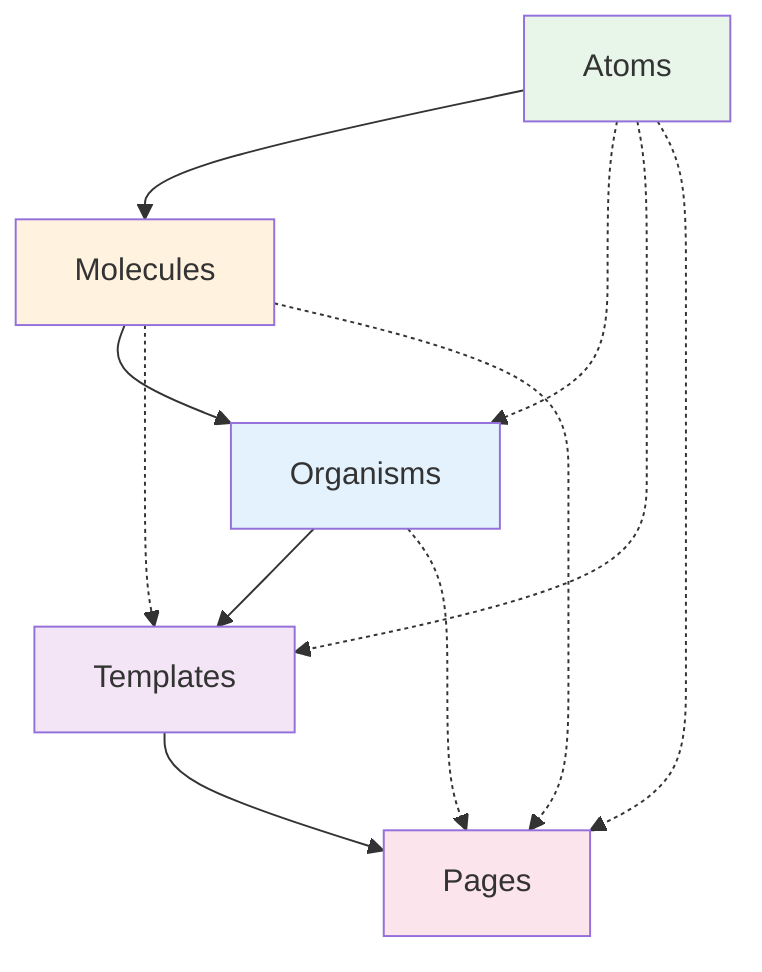

# Atomic Design Analysis & Migration Plan
## MTG Discovery Frontend React Application

*Analysis Date: September 30, 2025*
*Analyzed By: Claude Code*

---

## Executive Summary

The MTG Discovery React frontend currently implements a **partial atomic design pattern** with significant deviations from Brad Frost's methodology. While the component structure shows good separation at the atom and molecule levels, there are critical issues with organism categorization, template underutilization, and page placement that break the intended hierarchical flow of atomic design.

### Key Deviations Identified:
1. **Pages exist outside the component hierarchy** (in `src/pages/` instead of `src/components/pages/`)
2. **Templates are essentially unused** (only 1 template: Layout.tsx)
3. **Organisms are misclassified** (many are actually molecules or even large atoms)
4. **No clear composition hierarchy** from templates → pages
5. **Missing template patterns** that should orchestrate organism layouts

---

## Part 1: Current State Analysis

### 1.1 Directory Structure Reality

```
src/
├── components/           # Component library (85 total components)
│   ├── atoms/           # 33 components - properly categorized
│   ├── molecules/       # 29 components - mostly correct
│   ├── organisms/       # 16 components - many misclassified
│   ├── templates/       # 1 component - severely underutilized
│   ├── auth/            # 2 components - outside atomic structure
│   ├── providers/       # 1 component - outside atomic structure
│   └── examples/        # 1 component - outside atomic structure
├── pages/               # 7 page components - OUTSIDE component hierarchy
├── contexts/            # React contexts
├── hooks/               # Custom hooks
├── utils/               # Utilities
└── styles/              # Shared styles

```

### 1.2 Deviation Analysis by Level

#### **Atoms (33 components) - MOSTLY CORRECT ✓**
The atoms are generally well-categorized. These are true building blocks:
- `ManaSymbol.tsx` - Single-purpose icon component
- `RarityBadge.tsx` - Simple badge display
- `AppButton.tsx` - Wrapped MUI button with loading state
- `SetIcon.tsx` - Single icon display

**Issues:**
- Some atoms like `ResponsiveGrid.tsx` might be too complex for atoms
- `DebouncedSearchInput.tsx` has behavior logic that might belong in molecules

#### **Molecules (29 components) - PARTIALLY CORRECT ⚠️**
Good examples of proper molecules:
- `ManaCost.tsx` - Combines multiple `ManaSymbol` atoms
- `CardMetadata.tsx` - Combines multiple data display atoms
- `CardLinks.tsx` - Groups related link atoms

**Issues:**
- `FilterPanel.tsx` is complex enough to be an organism
- `QueryStateContainer.tsx` is more of a utility/provider than a molecule
- Some molecules like `AllPrintingsDisplay.tsx` fetch data (should be in organisms or pages)

#### **Organisms (16 components) - SIGNIFICANTLY MISCLASSIFIED ❌**
Current organisms show major categorization problems:

**Actually Organisms:**
- `CardDetailsModal.tsx` - Complex, combines molecules, standalone section
- `Header.tsx` / `Footer.tsx` - Major page sections

**Actually Molecules:**
- `CardCompact.tsx` - Just a card display variant, not complex enough
- `MtgSetCard.tsx` - Single set card display, should be molecule

**Actually Templates:**
- `CardGrid.tsx` - Defines layout for multiple cards
- `CardGroup.tsx` - Defines grouped card layout structure

**Duplicates/Confusion:**
- Both `Footer.tsx` and `AppFooter.tsx` exist

**Cleaned Up:**
- ✅ Removed unused `AppHeader.tsx` - only `Header.tsx` remains (used in Layout.tsx)

#### **Templates (1 component) - SEVERELY UNDERUTILIZED ❌❌**
Only `Layout.tsx` exists as a template, and it's very basic:
```tsx
<Box>
  <SkipNavigation />
  <Header />
  <main>{children}</main>
  <Footer />
</Box>
```

**Missing Templates:**
- Card browsing template (grid + filters + pagination)
- Search results template
- Details view template
- Collection management template
- List/table view template

#### **Pages (7 components) - INCORRECTLY PLACED ❌**
Pages exist in `src/pages/` instead of `src/components/pages/`, breaking the atomic hierarchy:

**Current Pages:**
- `AllSetsPage.tsx` - 174 lines, contains layout logic that should be in templates
- `SetPage.tsx` - 806 lines (!), massive file mixing concerns
- `CardSearchPage.tsx` - Contains template-like layout code
- `ArtistCardsPage.tsx` - Duplicates layout patterns from SetPage

**Problems:**
1. Pages directly import from all atomic levels (atoms, molecules, organisms)
2. Pages contain layout logic that belongs in templates
3. No clear separation between page logic and template structure
4. Massive page files (SetPage is 806 lines!)

### 1.3 Hierarchy Violations

The current structure violates atomic design's strict hierarchy:

**Ideal Flow:**
```
Atoms → Molecules → Organisms → Templates → Pages
(each level only imports from levels below)
```

**Current Reality:**
```
Atoms ← Molecules ← Organisms ← Pages (no template layer!)
         ↑_______________________|
         (Pages import directly from atoms)
```

### 1.4 Component Classification Issues

#### Components in Wrong Categories:

**Should be Atoms (currently Molecules):**
- None identified - molecules are generally appropriate

**Should be Molecules (currently Organisms):**
- `CardCompact.tsx` - Simple card variant
- `CardCompactResponsive.tsx` - Responsive wrapper
- `MtgSetCard.tsx` - Set card display
- `MtgSetCardWithCollection.tsx` - Set card with data
- ~~`MyCollectionButton.tsx` - Simple button with state~~ ✅ **COMPLETED**

**Should be Organisms (currently Molecules):**
- `FilterPanel.tsx` - Complex filtering UI with multiple sections
- `QueryStateContainer.tsx` - Complex state management wrapper
- `CollectorFiltersSection.tsx` - Multi-part filter section

**Should be Templates (currently Organisms):**
- `CardGrid.tsx` - Defines grid layout pattern
- `CardGroup.tsx` - Defines grouping layout pattern

**Should be in Utilities/Providers (currently in components):**
- `ErrorBoundary.tsx` - Technical utility
- `ErrorBoundaries.tsx` - Technical utility
- `I18nProvider.tsx` - Context provider

---

## Part 2: Ideal Atomic Design Structure

### 2.1 Proper Hierarchy Definition

According to Brad Frost's Atomic Design methodology:

#### **Atoms**
- Basic HTML elements or simple wrapped components
- Cannot be broken down further without losing meaning
- No complex logic, purely presentational
- Examples: Button, Input, Label, Icon, Badge

#### **Molecules**
- Simple combinations of atoms working together
- Single, simple purpose
- Can have simple internal state
- Examples: SearchField (Label + Input + Button), Card (Image + Text + Button)

#### **Organisms**
- Complex UI sections with distinct functionality
- Combine molecules and atoms into functional units
- Can fetch data and manage complex state
- Form distinct sections of an interface
- Examples: Header, ProductCard, NavigationMenu, FilterPanel

#### **Templates**
- Page-level layout structures
- Define content structure without real content
- Focus on layout and content hierarchy
- No data fetching - use placeholder content
- Examples: DashboardTemplate, SearchResultsTemplate, DetailViewTemplate

#### **Pages**
- Specific instances of templates with real content
- Connect to data sources
- Handle routing parameters
- Implement business logic
- Examples: UserDashboardPage, ProductSearchPage, ProductDetailPage

### 2.2 Ideal Structure for MTG Discovery

```
src/components/
├── atoms/
│   ├── buttons/
│   │   ├── Button.tsx
│   │   ├── IconButton.tsx
│   │   └── LoadingButton.tsx
│   ├── inputs/
│   │   ├── TextField.tsx
│   │   ├── Select.tsx
│   │   └── Checkbox.tsx
│   ├── display/
│   │   ├── Badge.tsx
│   │   ├── Chip.tsx
│   │   ├── Icon.tsx
│   │   └── Typography.tsx
│   └── layout/
│       ├── Box.tsx
│       ├── Container.tsx
│       └── Divider.tsx
│
├── molecules/
│   ├── cards/
│   │   ├── CardImage.tsx
│   │   ├── CardTitle.tsx
│   │   ├── CardStats.tsx
│   │   ├── ManaCost.tsx
│   │   └── PriceDisplay.tsx
│   ├── forms/
│   │   ├── SearchField.tsx
│   │   ├── SortSelector.tsx
│   │   └── FilterChips.tsx
│   └── navigation/
│       ├── Breadcrumb.tsx
│       ├── TabList.tsx
│       └── Pagination.tsx
│
├── organisms/
│   ├── cards/
│   │   ├── MtgCard.tsx           # Complete card display
│   │   ├── MtgSetCard.tsx        # Set-specific card
│   │   └── CardDetailsPanel.tsx  # Detailed card info section
│   ├── navigation/
│   │   ├── Header.tsx
│   │   ├── Footer.tsx
│   │   └── Sidebar.tsx
│   ├── filters/
│   │   ├── FilterPanel.tsx       # Complex filter system
│   │   └── AdvancedSearch.tsx    # Advanced search form
│   └── displays/
│       ├── CardGrid.tsx          # Grid of cards (not layout!)
│       ├── SetCollection.tsx     # Set of related items
│       └── ResultsSummary.tsx    # Results with stats
│
├── templates/
│   ├── layouts/
│   │   ├── MainLayout.tsx        # App shell with header/footer
│   │   ├── SidebarLayout.tsx     # Layout with sidebar
│   │   └── FullWidthLayout.tsx   # Full width container
│   ├── pages/
│   │   ├── BrowseTemplate.tsx    # Browse/filter/grid template
│   │   ├── SearchTemplate.tsx    # Search results template
│   │   ├── DetailTemplate.tsx    # Detail view template
│   │   └── DashboardTemplate.tsx # Dashboard template
│   └── modals/
│       ├── ModalTemplate.tsx     # Standard modal template
│       └── WizardTemplate.tsx    # Multi-step modal template
│
└── pages/
    ├── sets/
    │   ├── AllSetsPage.tsx
    │   └── SetDetailsPage.tsx
    ├── cards/
    │   ├── CardSearchPage.tsx
    │   ├── CardDetailsPage.tsx
    │   └── CardPrintingsPage.tsx
    ├── artists/
    │   ├── ArtistSearchPage.tsx
    │   └── ArtistDetailsPage.tsx
    └── user/
        ├── DashboardPage.tsx
        └── CollectionPage.tsx
```

### 2.3 Proper Component Relationships



Solid lines = primary relationships
Dotted lines = allowed but less common

---

## Part 3: Migration Strategy

### 3.1 Migration Phases

#### **Phase 1: Foundation (Week 1)**
1. Create proper template components
2. Establish clear template patterns
3. Document template usage guidelines

#### **Phase 2: Reorganization (Week 2)**
1. Move pages into component hierarchy
2. Reclassify misplaced organisms/molecules
3. Consolidate duplicate components

#### **Phase 3: Refactoring (Week 3-4)**
1. Extract layout logic from pages to templates
2. Break down large page files
3. Implement proper data flow

#### **Phase 4: Optimization (Week 5)**
1. Remove cross-level imports
2. Standardize component interfaces
3. Update documentation

### 3.2 Detailed Migration Plan

#### **Step 1: Create Missing Templates**

Create these essential templates:

**BrowseTemplate.tsx**
```tsx
interface BrowseTemplateProps {
  filters: React.ReactNode;
  results: React.ReactNode;
  pagination?: React.ReactNode;
  summary?: React.ReactNode;
}

export const BrowseTemplate: React.FC<BrowseTemplateProps> = ({
  filters,
  results,
  pagination,
  summary
}) => {
  return (
    <Container>
      <Box>{filters}</Box>
      {summary && <Box>{summary}</Box>}
      <Box>{results}</Box>
      {pagination && <Box>{pagination}</Box>}
    </Container>
  );
};
```

**SearchResultsTemplate.tsx**
```tsx
interface SearchResultsTemplateProps {
  searchBar: React.ReactNode;
  filters?: React.ReactNode;
  results: React.ReactNode;
  emptyState?: React.ReactNode;
}
```

**DetailViewTemplate.tsx**
```tsx
interface DetailViewTemplateProps {
  header: React.ReactNode;
  mainContent: React.ReactNode;
  sidebar?: React.ReactNode;
  relatedContent?: React.ReactNode;
}
```

#### **Step 2: Reclassify Components**

**Move to Molecules:**
```bash
mv src/components/organisms/CardCompact.tsx src/components/molecules/cards/
mv src/components/organisms/MtgSetCard.tsx src/components/molecules/cards/
# mv src/components/organisms/MyCollectionButton.tsx src/components/molecules/ui/ ✅ **COMPLETED**
```

**Move to Organisms:**
```bash
mv src/components/molecules/shared/FilterPanel.tsx src/components/organisms/filters/
mv src/components/molecules/shared/QueryStateContainer.tsx src/components/organisms/containers/
```

**Move to Templates:**
```bash
# These need refactoring first to separate layout from logic
# CardGrid.tsx → Extract layout to GridTemplate.tsx
# CardGroup.tsx → Extract layout to GroupTemplate.tsx
```

#### **Step 3: Refactor Pages**

Example refactoring of `AllSetsPage.tsx`:

**Before (174 lines):**
```tsx
// Everything in one file - layout, logic, UI
export const AllSetsPage = () => {
  // ... 174 lines of mixed concerns
};
```

**After:**

`templates/pages/BrowseTemplate.tsx`:
```tsx
export const BrowseTemplate = ({ filters, grid, summary }) => (
  <Container>
    <Typography variant="h3">All Sets</Typography>
    {filters}
    {summary}
    {grid}
  </Container>
);
```

`pages/AllSetsPage.tsx`:
```tsx
export const AllSetsPage = () => {
  const { data, loading, error } = useQuery(GET_ALL_SETS);
  const filterState = useFilterState();

  return (
    <BrowseTemplate
      filters={<FilterPanel config={filterConfig} />}
      summary={<ResultsSummary data={data} />}
      grid={<SetGrid sets={data} onSetClick={handleSetClick} />}
    />
  );
};
```

#### **Step 4: Break Down Large Files**

The 806-line `SetPage.tsx` needs to be split:

1. **SetPageTemplate.tsx** - Layout structure
2. **SetPageFilters.tsx** - Filter organism
3. **SetPageCards.tsx** - Card display organism
4. **SetPageStats.tsx** - Statistics organism
5. **SetPage.tsx** - Page orchestrator (< 100 lines)

#### **Step 5: Update Import Paths**

Create barrel exports for each level:

`components/atoms/index.ts`:
```tsx
export * from './buttons';
export * from './inputs';
export * from './display';
export * from './layout';
```

Update imports to respect hierarchy:
```tsx
// ❌ Bad: Page importing from atoms directly
import { Button } from '../../atoms/shared/AppButton';

// ✓ Good: Page importing from templates
import { BrowseTemplate } from '../templates/pages/BrowseTemplate';
```

### 3.3 Migration Checklist

- [ ] **Templates Created**
  - [ ] MainLayout template
  - [ ] BrowseTemplate
  - [ ] SearchTemplate
  - [ ] DetailTemplate
  - [ ] DashboardTemplate

- [ ] **Components Reclassified**
  - [ ] CardCompact → molecules
  - [ ] FilterPanel → organisms
  - [ ] Layout patterns → templates

- [ ] **Pages Refactored**
  - [ ] AllSetsPage uses BrowseTemplate
  - [ ] SetPage split into < 200 line files
  - [ ] SearchPages use SearchTemplate

- [ ] **Hierarchy Enforced**
  - [ ] No cross-level imports
  - [ ] Clear data flow direction
  - [ ] Consistent interfaces

- [ ] **Documentation Updated**
  - [ ] Component guidelines
  - [ ] Template usage docs
  - [ ] Migration notes

---

## Part 4: Benefits Assessment

### 4.1 Immediate Benefits

#### **Better Code Organization**
- Clear component categories
- Predictable file locations
- Easier onboarding for new developers

#### **Improved Maintainability**
- Smaller, focused files (target: < 200 lines)
- Single responsibility components
- Clearer separation of concerns

#### **Enhanced Reusability**
- Templates enable consistent layouts
- Reduced code duplication
- Composable UI patterns

### 4.2 Long-term Benefits

#### **Scalability**
- New pages follow established templates
- Component library grows systematically
- Consistent patterns across the app

#### **Testing**
- Isolated component testing
- Template testing separate from page logic
- Better test coverage

#### **Performance**
- Better code splitting opportunities
- Optimized bundle sizes
- Lazy loading by component level

#### **Developer Experience**
- Intuitive component discovery
- Reduced cognitive load
- Faster feature development

### 4.3 Metrics for Success

| Metric | Current | Target | Benefit |
|--------|---------|--------|---------|
| Average file size | 180 lines | < 150 lines | Easier to understand |
| Largest file | 806 lines | < 300 lines | Maintainable |
| Template usage | 1 template | 8+ templates | Consistency |
| Cross-level imports | 45+ | 0 | Clear hierarchy |
| Component categories | Confused | Clear | Discoverability |
| Code duplication | High | Low | DRY principle |

---

## Part 5: Implementation Recommendations

### 5.1 Priority Order

**High Priority (Do First):**
1. Create BrowseTemplate for list views
2. Refactor SetPage (806 lines is unmanageable)
3. Move FilterPanel to organisms
4. Create SearchTemplate

**Medium Priority:**
1. Reclassify remaining organisms
2. Create DetailTemplate
3. Consolidate duplicate components
4. Move pages to component hierarchy

**Low Priority:**
1. Update all import paths
2. Create barrel exports
3. Document patterns
4. Add Storybook stories

### 5.2 Risk Mitigation

**Risks:**
1. **Breaking existing functionality**
   - Mitigation: Incremental refactoring with tests

2. **Confusing team during transition**
   - Mitigation: Clear documentation and gradual rollout

3. **Merge conflicts**
   - Mitigation: Coordinate with team, small PRs

4. **Performance regression**
   - Mitigation: Monitor bundle sizes, use React.memo

### 5.3 Success Criteria

The migration is successful when:

1. **All pages use templates** (no layout logic in pages)
2. **No file exceeds 300 lines** (preferably < 200)
3. **Clear component hierarchy** is maintained
4. **Zero cross-level imports** exist
5. **Documentation is complete** and accurate

### 5.4 Team Guidelines

**For New Components:**
1. Start by identifying the atomic level
2. Check if similar patterns exist
3. Use templates for any page-like structure
4. Keep files under 150 lines
5. Follow the hierarchy strictly

**For Existing Components:**
1. Refactor when touching the code
2. Boy Scout Rule: leave code better than found
3. Extract templates when patterns emerge
4. Split large files incrementally

---

## Conclusion

The MTG Discovery frontend has a solid foundation with its atomic structure at the atom and molecule levels. However, significant work is needed to properly implement the organism, template, and page levels according to atomic design principles.

The most critical issues are:
1. **Missing template layer** - Only 1 template exists
2. **Misclassified organisms** - Many are molecules
3. **Pages outside hierarchy** - Break the atomic flow
4. **Massive page files** - SetPage is 806 lines!

The proposed migration plan addresses these issues systematically, with templates being the highest priority. Creating proper templates will immediately improve code organization and enable better separation of concerns.

The investment in proper atomic design will pay dividends in:
- **Developer productivity** through clear patterns
- **Code quality** through smaller, focused components
- **Maintainability** through proper separation of concerns
- **Scalability** through reusable templates

**Recommended Action:** Begin with Phase 1 immediately - create templates for the most common page patterns. This will provide immediate value and establish patterns for the rest of the migration.

---

## Appendix A: Component Classification Guide

### Quick Decision Tree

```
Is it a single UI element that can't be broken down?
  → YES: Atom
  → NO: Continue

Is it a simple group of atoms working together for one purpose?
  → YES: Molecule
  → NO: Continue

Is it a complex, standalone section with multiple molecules/atoms?
  → YES: Organism
  → NO: Continue

Does it define page-level layout without real content?
  → YES: Template
  → NO: Continue

Does it represent a specific route with real data?
  → YES: Page
  → NO: Reconsider classification
```

### Examples by Category

**Atoms:**
- Button, Input, Label, Icon
- Badge, Chip, Avatar
- Typography elements

**Molecules:**
- SearchField (Label + Input + Button)
- Card (Image + Title + Description)
- FormField (Label + Input + Error)

**Organisms:**
- Header (Logo + Nav + User Menu)
- ProductCard (Image + Details + Actions)
- FilterPanel (Multiple filter types)

**Templates:**
- TwoColumnLayout
- DashboardGrid
- MasterDetailLayout

**Pages:**
- HomePage
- ProductDetailPage
- UserProfilePage

---

## Appendix B: File Size Analysis

### Current File Sizes (Top 10 Largest)

1. `SetPage.tsx` - 806 lines ⚠️
2. `ArtistCardsPage.tsx` - 423 lines ⚠️
3. `MtgCard.tsx` - 384 lines ⚠️
4. `CardAllPrintingsPage.tsx` - 229 lines
5. `AllSetsPage.tsx` - 174 lines
6. `CardSearchPage.tsx` - 165 lines
7. `ArtistSearchPage.tsx` - 161 lines
8. `ManaSymbol.tsx` - 140 lines
9. `FilterPanel.tsx` - 135 lines
10. `CardDetailsModal.tsx` - 128 lines

### Refactoring Targets

Files needing immediate attention (> 300 lines):
- `SetPage.tsx` - Split into 5+ files
- `ArtistCardsPage.tsx` - Extract template, split logic
- `MtgCard.tsx` - Extract helpers, split concerns

### Target Architecture Metrics

- **Atoms:** 20-50 lines average
- **Molecules:** 30-80 lines average
- **Organisms:** 50-150 lines average
- **Templates:** 40-100 lines average
- **Pages:** 50-150 lines average

No file should exceed 300 lines. Ideal target is under 150 lines.

---

*End of Analysis Document*