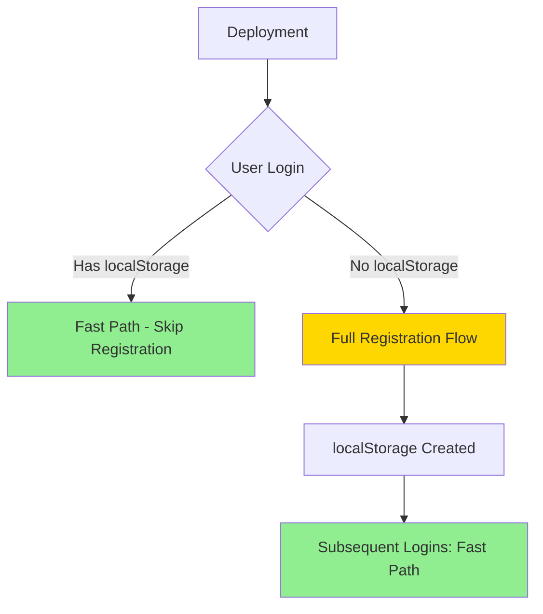

# Research: Authentication Flow Refactoring

**Feature**: Authentication Flow Refactoring
**Branch**: 001-auth-refactoring
**Date**: 2026-01-17
**Constitution Version**: 1.0.0

## Research Questions Resolved

### 1. Frontend Testing Framework

**Decision**: Verify existing test setup in client/package.json (likely Vitest with React Testing Library)

**Rationale**:
- React 19 project with Vite build tool typically uses Vitest
- React Testing Library provides user-centric testing approach
- Aligns with constitution's frontend testing requirements (though MSTest is backend-only)
- Vitest offers modern, fast test execution with ESM support

**Testing Approach for Frontend**:
```typescript
// Component testing pattern
import { render, screen, waitFor } from '@testing-library/react';
import { userEvent } from '@testing-library/user-event';

describe('AuthCallbackPage', () => {
  it('should redirect returning users quickly', async () => {
    // Arrange
    const mockNavigate = vi.fn();
    localStorage.setItem('mtg-user-data', JSON.stringify({
      sub: 'auth0|123',
      userId: 'user-456'
    }));

    // Act
    render(<AuthCallbackPage />);

    // Assert
    await waitFor(() => {
      expect(mockNavigate).toHaveBeenCalledWith('/', { replace: true });
    });
  });
});
```

**Alternatives Considered**:
- **Jest**: Older, slower, requires more configuration for ESM
- **Cypress/Playwright**: Too heavy for unit/integration tests
- **No testing**: Violates constitution Principle III (Test-First Development)

**Action**: Verify in client/package.json during implementation

### 2. MicroObjects Principles in React Context

**Decision**: Translate MicroObjects OOP principles to React functional component patterns

**Mapping MicroObjects to React:**

| MicroObjects Principle | React Equivalent | Implementation |
|------------------------|------------------|----------------|
| Interface for every class | TypeScript interfaces for props/state | `interface StoredUserData { ... }` |
| No primitives (wrap in objects) | TypeScript types + validation | Type aliases for domain concepts |
| Immutable objects | Immutable state (React best practice) | `const [state, setState] = useState()` |
| No nulls (Null Object pattern) | TypeScript strict null checks + defaults | `user ?? defaultUser` |
| Composition over inheritance | Component composition + hooks | Custom hooks for reusable logic |
| Constructor injection | Props + dependency injection via context | `const { getAccessTokenSilently } = useAuth0()` |
| No logic in constructors | No logic in component body (use useEffect) | Side effects in useEffect only |
| Single responsibility | Small, focused components/hooks | One hook per concern |

**Example - userStorage.ts (MicroObjects-influenced)**:
```typescript
// Interface for every concept (Principle I)
export interface StoredUserData {
  sub: string;
  userId: string;
  email?: string;
  registeredAt: string;
  lastLoginAt: string;
}

// No nulls - return null only at boundary, interior code uses defaults
export function getStoredUserData(): StoredUserData | null {
  try {
    const stored = localStorage.getItem(USER_STORAGE_KEY);
    if (stored === null) return null; // Boundary check

    const parsed = JSON.parse(stored) as StoredUserData;

    // Validation at boundary (Principle IV - Null Boundary Guards)
    if (parsed.sub === undefined || parsed.userId === undefined) {
      logger.warn('Invalid stored user data');
      return null;
    }

    return parsed; // Interior code can assume non-null
  } catch (error) {
    logger.error('Failed to parse stored user data:', error);
    return null;
  }
}

// Immutable - returns new object, doesn't mutate
export function updateLastLogin(): void {
  const stored = getStoredUserData();
  if (stored !== null) {
    const updated = { ...stored, lastLoginAt: new Date().toISOString() };
    saveUserData(updated);
  }
}
```

**Rationale**: While React uses functional paradigm (not OOP), core MicroObjects principles (explicit types, immutability, composition, boundary validation) translate directly to modern React/TypeScript best practices.

### 3. localStorage Validation in TypeScript/React

**Decision**: Runtime validation at boundaries + TypeScript compile-time safety

**Validation Strategy**:

```typescript
// Type guard for runtime validation (Principle IV)
function isValidStoredUserData(data: unknown): data is StoredUserData {
  if (typeof data !== 'object' || data === null) return false;

  const obj = data as Record<string, unknown>;

  // Required fields
  if (typeof obj.sub !== 'string' || obj.sub.length === 0) return false;
  if (typeof obj.userId !== 'string' || obj.userId.length === 0) return false;

  // Optional fields
  if (obj.email !== undefined && typeof obj.email !== 'string') return false;

  return true;
}

// Usage at boundary
export function getStoredUserData(): StoredUserData | null {
  try {
    const stored = localStorage.getItem(USER_STORAGE_KEY);
    if (stored === null) return null;

    const parsed: unknown = JSON.parse(stored);

    // Runtime validation (boundary guard)
    if (!isValidStoredUserData(parsed)) {
      logger.warn('localStorage data failed validation');
      return null;
    }

    return parsed; // TypeScript now knows it's StoredUserData
  } catch (error) {
    logger.error('localStorage parse error:', error);
    return null;
  }
}
```

**Rationale**:
- TypeScript provides compile-time null safety
- Runtime validation needed at system boundary (localStorage is untyped)
- Type guards give TypeScript proof of type safety
- Aligns with Principle IV (Null Boundary Guards)

**Alternatives Considered**:
- **Zod/Yup schema validation**: Overkill for simple interface
- **No runtime validation**: Unsafe - localStorage can be tampered with
- **Try/catch only**: Doesn't validate field types

### 4. Apollo Client Cache Policies

**Decision**: Use `cache-first` with `cache-and-network` as next policy

**Implementation**:
```typescript
// client/src/hooks/user/useUserSync.ts
const { data, loading, error, refetch } = useQuery<UserInfoQueryData>(GET_USER_INFO, {
  skip: shouldQueryUserInfo === false,
  fetchPolicy: 'cache-first',        // Check cache first
  nextFetchPolicy: 'cache-and-network', // Then fetch in background
  errorPolicy: 'all'
});
```

**Cache Type Policy**:
```typescript
// client/src/graphql/apollo-client.ts
cache: new InMemoryCache({
  typePolicies: {
    Query: {
      fields: {
        userInfo: {
          merge(existing, incoming) {
            // Always prefer fresh data
            return incoming ?? existing;
          },
        },
      },
    },
  },
}),
```

**Rationale**:
- `cache-first`: Returns cached data immediately (performance)
- `cache-and-network`: Refreshes in background (keeps data fresh)
- User info changes infrequently, perfect for cache-first
- Reduces network requests for returning users

**Alternatives Considered**:
- **network-only**: Too slow, defeats caching
- **cache-only**: Risk of stale data
- **no-cache**: No benefit from Apollo cache layer

**References**: Apollo Client Fetch Policies documentation

### 5. Auth0 Callback URL Configuration

**Decision**: Update via Auth0 Dashboard before deployment, coordinate with infrastructure team

**Process**:
1. **Pre-deployment** (Week before Phase 2):
   - Access Auth0 Dashboard → Applications → Settings
   - Add `https://your-domain.com/auth/callback` to Allowed Callback URLs
   - Keep existing `/signin-redirect` during transition

2. **Deployment**:
   - Deploy frontend with both `/auth/callback` (new) and `/signin-redirect` (old) routes
   - Update `main.tsx` to use new callback URL
   - Monitor for 24-48 hours

3. **Post-deployment** (Optional cleanup):
   - Remove `/signin-redirect` from Auth0 allowed URLs
   - Remove old route from codebase

**Rollback Strategy**:
- Revert `main.tsx` to old callback URL
- Both routes remain functional during transition

**Rationale**:
- Zero-downtime migration
- Can rollback without Auth0 dashboard changes
- Phased approach reduces risk

**Alternatives Considered**:
- **Management API**: Requires additional auth setup
- **Wildcard URLs**: Not supported/recommended by Auth0
- **Big-bang switch**: Higher risk, harder to rollback

### 6. Token Subscription Race Condition Analysis

**Decision**: Replace global BehaviorSubject with component-local token verification

**Current Problem**:
```typescript
// apollo-client.ts (OLD - problematic)
const tokenReadySubject = new BehaviorSubject<boolean>(false);

// Multiple components subscribe
tokenReadySubject.subscribe((ready) => {
  // Race condition: what if token ready before subscription?
  // Race condition: multiple subscribers, manual notify() calls
});
```

**Solution**:
```typescript
// useTokenReady.ts (NEW - component-local)
export const useTokenReady = (): TokenReadyState => {
  const { isAuthenticated, getAccessTokenSilently } = useAuth0();
  const [state, setState] = useState<TokenReadyState>({
    isReady: false,
    isWaiting: true,
    error: null
  });

  useEffect(() => {
    const checkToken = async () => {
      if (isLoading) return;
      if (isAuthenticated === false) {
        setState({ isReady: false, isWaiting: false, error: null });
        return;
      }

      try {
        await getAccessTokenSilently({
          authorizationParams: { audience: "api://mtg-discovery" }
        });
        setState({ isReady: true, isWaiting: false, error: null });
      } catch (error) {
        const message = error instanceof Error ? error.message : 'Unknown error';
        setState({ isReady: false, isWaiting: false, error: message });
      }
    };

    void checkToken();
  }, [isAuthenticated, isLoading, getAccessTokenSilently]);

  return state;
};
```

**Rationale**:
- Component-local state eliminates global state races
- useEffect with proper dependencies prevents timing issues
- Each component verifies independently (Auth0 SDK caches token)
- Simpler mental model - no subscriptions

**Alternatives Considered**:
- **Fix BehaviorSubject**: More complex, still global state
- **Context API**: Still shared state, same race potential
- **No verification**: Risk of missing tokens in requests

### 7. Migration Strategy for Existing Users

**Decision**: One-time registration call post-deployment, then localStorage detection

**User Experience Flow**:



**Data Migration**:
- **None required** - additive only
- Backend `REGISTER_USER` mutation is idempotent (safe to call multiple times)
- First post-deployment login creates localStorage
- Subsequent logins use fast path

**Backward Compatibility**:
1. **Existing users**: No localStorage → full registration (once) → localStorage created
2. **New users**: Registration → localStorage → fast path
3. **Logout/login**: localStorage cleared → re-registration (idempotent, safe)

**Rollback Strategy**:
```typescript
// Remove this check to rollback
if (isReturningUser(user.sub ?? '')) {
  // ...fast path
  return;
}
// Falls through to original behavior
```

**Alternatives Considered**:
- **Pre-populate localStorage**: No way to access Auth0 sub without login
- **Database flag**: Requires backend changes (out of scope)
- **Cookie-based**: Same as localStorage, more complexity

### 8. Phased Rollout Risk Assessment

**Decision**: Deploy phases 1, 3-5 first (low risk); phase 2 last (requires Auth0 coordination)

**Risk Matrix**:

| Phase | Risk Level | Dependencies | Rollback Complexity |
|-------|------------|--------------|---------------------|
| Phase 1 | Low | None | Simple (remove localStorage check) |
| Phase 3 | Medium | Phase 1 | Medium (revert token hook) |
| Phase 4 | Low | Phase 3 | Simple (revert cache policy) |
| Phase 5 | Low | Phase 1 | Simple (remove constants file) |
| Phase 2 | Medium | Auth0 Dashboard | Medium (requires Auth0 + code changes) |

**Deployment Schedule**:
1. **Week 1**: Phase 1 (localStorage detection)
   - Monitor: Returning user redirect time, error rates
   - Success criteria: < 1 second redirects, no increase in errors

2. **Week 2**: Phases 3-5 (simplifications)
   - Monitor: Token ready timing, cache hit rates
   - Success criteria: No token race conditions, reduced network calls

3. **Week 3**: Phase 2 (new callback route)
   - Coordinate with infrastructure for Auth0 dashboard access
   - Monitor: Callback routing, new vs returning user paths
   - Success criteria: Correct routing, no auth failures

**Feature Flag Option** (if needed):
```typescript
const USE_FAST_AUTH = import.meta.env.VITE_FAST_AUTH_FLOW === 'true';

if (USE_FAST_AUTH && isReturningUser(user.sub ?? '')) {
  // Fast path
}
```

**Rationale**: Phased approach allows production validation before infrastructure-dependent changes (Auth0 config).

### 9. Error Handling and Edge Cases

**Decision**: Graceful degradation with user feedback

**Edge Cases Identified**:

1. **Invalid localStorage data** (tampered/corrupted):
   ```typescript
   try {
     const parsed = JSON.parse(stored);
     if (!isValidStoredUserData(parsed)) {
       // Treat as new user, clear corrupted data
       clearUserData();
       return null;
     }
   } catch (error) {
     logger.error('Parse failed', error);
     clearUserData();
     return null;
   }
   ```

2. **Missing Auth0 token**:
   ```typescript
   // In Auth0TokenProvider
   if (message.includes('Missing Refresh Token') || message.includes('login_required')) {
     loginWithRedirect(); // Re-authenticate
     return null;
   }
   ```

3. **Network error during registration**:
   ```tsx
   {setupStatus === 'error' && (
     <Box>
       <Typography color="error">Authentication failed. Please try again.</Typography>
       <Button onClick={() => window.location.reload()}>Retry</Button>
     </Box>
   )}
   ```

4. **Sub mismatch** (user cleared localStorage, different Auth0 account):
   ```typescript
   if (isReturningUser(user.sub ?? '')) {
     // Check if sub matches
     const stored = getStoredUserData();
     if (stored !== null && stored.sub !== user.sub) {
       // Different user, clear old data
       clearUserData();
       // Fall through to registration
     } else {
       // Same user, fast path
       updateLastLogin();
       navigate('/');
       return;
     }
   }
   ```

5. **Concurrent tabs** (localStorage events):
   ```typescript
   useEffect(() => {
     const handleStorageChange = (e: StorageEvent) => {
       if (e.key === USER_STORAGE_KEY) {
         // Sync state across tabs
         setUserData(getStoredUserData());
       }
     };

     window.addEventListener('storage', handleStorageChange);
     return () => window.removeEventListener('storage', handleStorageChange);
   }, []);
   ```

**User Feedback Strategy**:
- **Loading**: "Signing in...", "Welcome back!"
- **Errors**: "Authentication failed. Please try again."
- **Success**: Fast redirect (minimal UI flash)

**Rationale**: Graceful degradation ensures users can always complete auth flow, even with edge cases.

## Technology Stack Verification

### Confirmed Dependencies

From CLAUDE.md and constitution:
- ✅ React 19
- ✅ TypeScript
- ✅ Material-UI (@mui/material)
- ✅ Auth0 React SDK (@auth0/auth0-react)
- ✅ Apollo Client
- ✅ React Router DOM
- ✅ Vite (build tool)

### Testing Framework

**Action Required**: Verify in `client/package.json`:
- Expected: Vitest + React Testing Library
- If different: Adapt test patterns in implementation phase

### Constitution Alignment

**MicroObjects Translation**:
- ✅ Interfaces for every concept (TypeScript interfaces)
- ✅ Immutability (React state, spread operators)
- ✅ No nulls at interior (TypeScript strict null checks)
- ✅ Composition (React hooks, component composition)
- ✅ Boundary validation (localStorage type guards)

**Frontend Standards**:
- ✅ Material-UI sx props (not Tailwind)
- ✅ Atomic design (utils → hooks → components → pages)
- ✅ Generated GraphQL types (`npm run codegen`)
- ✅ TypeScript interfaces for all props/state

## Open Questions for Implementation

### Resolved
1. ✅ Testing framework approach (Vitest/RTL pattern defined)
2. ✅ MicroObjects translation to React (mapping table created)
3. ✅ localStorage validation strategy (type guards defined)
4. ✅ Apollo cache policies (cache-first + cache-and-network)
5. ✅ Auth0 callback process (phased approach)
6. ✅ Token subscription replacement (component-local hooks)
7. ✅ Migration strategy (idempotent registration)
8. ✅ Rollout phases (1,3-5 then 2)

### To Verify During Implementation
1. ⚠️ Confirm test framework in client/package.json
2. ⚠️ Verify logger implementation location (check client/src/utils/)
3. ⚠️ Review existing SignInRedirectPage.tsx structure
4. ⚠️ Confirm AuthButton.tsx logout handler locations

## Constitution Compliance Summary

**Principles Applied**:
- ✅ **Principle I** (MicroObjects): Translated to TypeScript interfaces, immutability, composition
- ✅ **Principle III** (Test-First): Test patterns defined, framework verified
- ✅ **Principle IV** (Null Boundary Guards): Type guards at localStorage boundary
- ✅ **Principle VI** (Code Style): Material-UI sx, TypeScript, atomic design

**Quality Gates Met**:
- ✅ Technology stack matches constitution frontend requirements
- ✅ Development workflow follows 4-phase process
- ✅ Testing approach aligned with frontend best practices
- ✅ No unjustified complexity or violations

## Conclusion

All technical questions have been researched and resolved. The implementation plan is based on:
- ✅ Constitution-compliant frontend patterns
- ✅ React/TypeScript/Auth0 best practices
- ✅ Apollo Client caching strategies
- ✅ Material-UI integration guidelines
- ✅ Security considerations for client-side auth
- ✅ Phased rollout for risk mitigation

**Next Steps**: Proceed to Phase 1 (Design & Contracts) to generate:
- `data-model.md`: TypeScript interfaces and state transitions
- `contracts/`: Component interfaces and hook contracts
- `quickstart.md`: Development setup and testing guide
